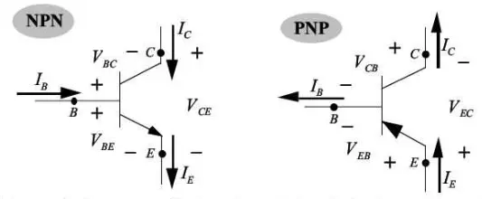
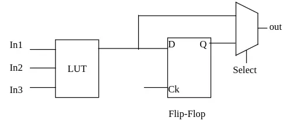

## Transistor theory

Transistors are one of the main components in electronics, and they can function as amplifiers, switches, or signal modulators. A transistor is a device with three terminals, one of which acts as a control terminal, regulating the behavior of the other two terminals. There are two main types of transistors: BJT and FET.

The **BJT** (Bipolar Junction Transistors) transistors are devices formed by two PN junctions, one of them in forward bias and the other in reverse bias. This configuration allows the flow of electrons and holes between the collector and the emitter, while the base regulates this flow. BJT transistors can have two types of PN junctions: the NPN type, where an N-type region is placed between two P-type regions, and the PNP type, where a P-type region is placed between two N-type regions. Each of these regions corresponds to a terminal: base, collector, or emitter.

**FET** (Field-Effect Transistors) are semiconductor devices that control the flow of current using an electric field. Among them, MOSFETs are the most common, consisting of a gate, drain, and source. Unlike BJTs, MOSFETs are controlled by voltage rather than current, making them more energy-efficient. Their high switching speed and low power dissipation make them essential components in digital electronics, particularly in integrated circuits such as processors and memory devices.

Integrated circuits (ICs) are basically circuits made up of electronic components such as transistors, resistors, capacitors, and others, which are physically connected and assembled on a chip to perform a specific function. They can be as simple as a logic gate, like the 7400 series, or as complex as microprocessors or microcontrollers.

## FPGA

[Recommended video](https://www.youtube.com/watch?v=H5MV7U8UHhk)

**FPGAs** (Field Programmable Gate Arrays), unlike other devices such as microcontrollers or microprocessors designed to interpret and execute a set of instructions, allow the hardware to be configured through configurable physical connections. This means that, instead of having a fixed circuit, the FPGA allows reconfiguring its internal components, such as transistors and logic gates, to form specific circuits that perform particular tasks.

FPGAs consist of an array of interconnected logic blocks that group logical cells. The logical cells are electronic components, mainly LUTs, multiplexers, and flip-flops.

- A **LUT** (Look-Up Table) is a table configured within an FPGA used to implement logical functions efficiently. It stores the result of all possible input combinations, allowing the corresponding output to be generated quickly for each set of inputs.
- A **multiplexer** is a digital component that selects one of several inputs and directs it to a single output, based on control signals. It works like a switch, where the control signals determine which input is passed to the output at any given time.
- A **flip-flop** is a storage circuit for a single bit of information, which can maintain its state (0 or 1) until a control signal, such as a clock pulse, is received. Its operation is based on changing its output state in response to this signal, enabling synchronization and data storage in digital systems, such as registers or counters.

The logic blocks of FPGAs are connected by a matrix of programmable routes, allowing the connections between them to be changed as needed. This reconfiguration capability makes the hardware flexible, as custom circuits can be created and modified to perform specific functions, adapting to different tasks.
FPGAs include other elements apart from the logic blocks, such as memories, input and output blocks that facilitate interaction with the outside, and even microcontrollers integrated into some models, making them quite complete for various types of projects.

### FPGA configuration
The FPGA design process begins with the creation of the HDL code, which defines the logic and behavior of the circuit. This code is synthesized to generate a netlist, which is a diagram of the necessary connections and logic elements. Next, the map, place, and route process takes place, where the connections and logic blocks are assigned to specific areas of the FPGA. Finally, a bitstream file is generated, which is loaded onto the FPGA, configuring the physical connections and allowing the device to execute the designed program.

Download [verilator](https://verilator.org/guide/latest/) 

